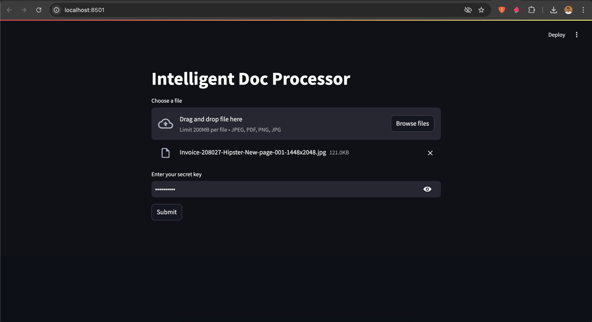
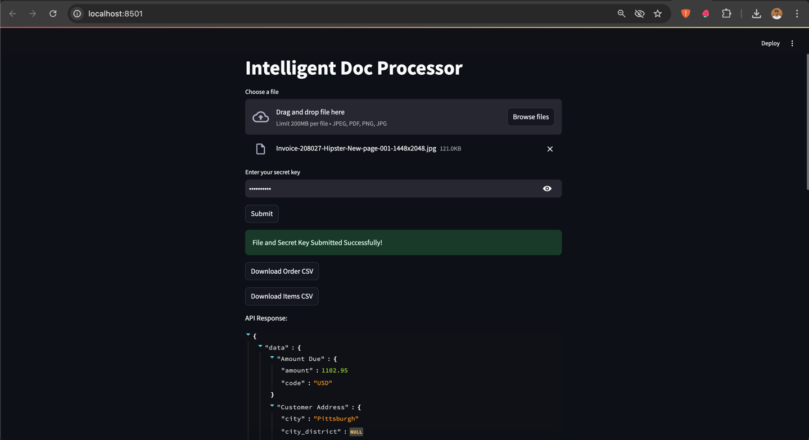
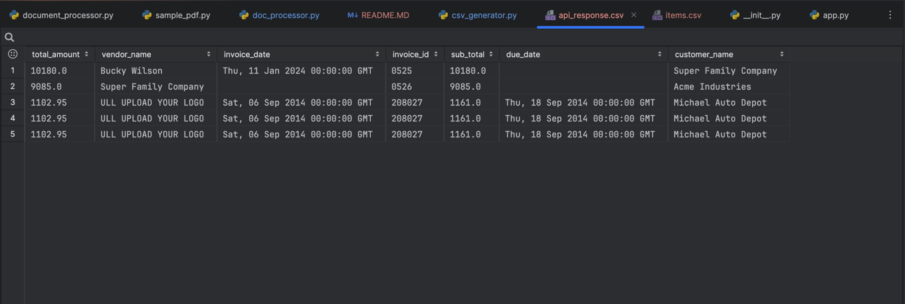
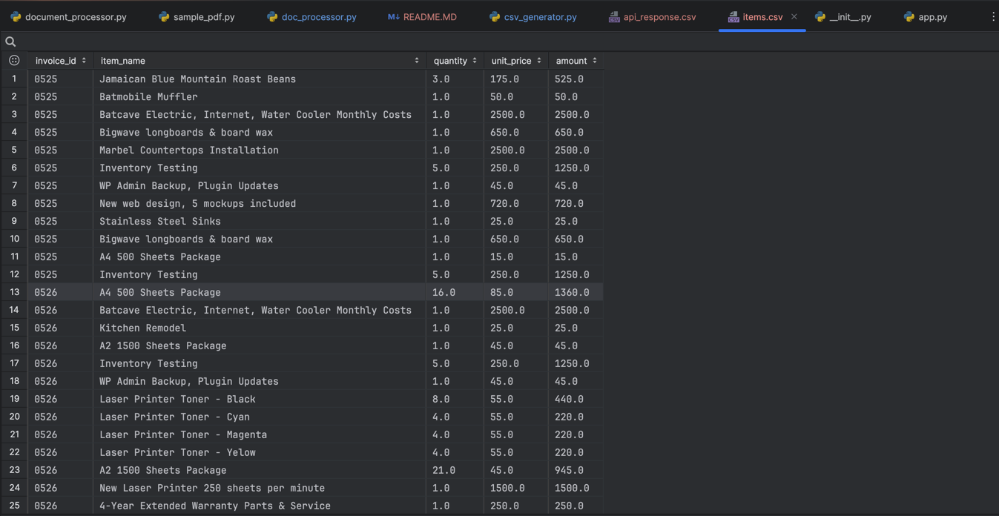

# Doc-intelligence-ai

Doc-intelligence-ai is an AI-powered tool that extracts the data from the invoices and stores information in the CSV file.

## Installation

Use the package manager [pip](https://pip.pypa.io/en/stable/) to install requirement.txt.

```bash
pip install -r requirements.txt
```

## ENV

```
Sample
```

### Run the BE
```
python app.py 
```

### Run streamlit app
```
streamlit run streamlit_src/doc_processor.py
```

### Images





#### reference:
https://learn.microsoft.com/en-us/azure/ai-services/document-intelligence/?view=doc-intel-4.0.0